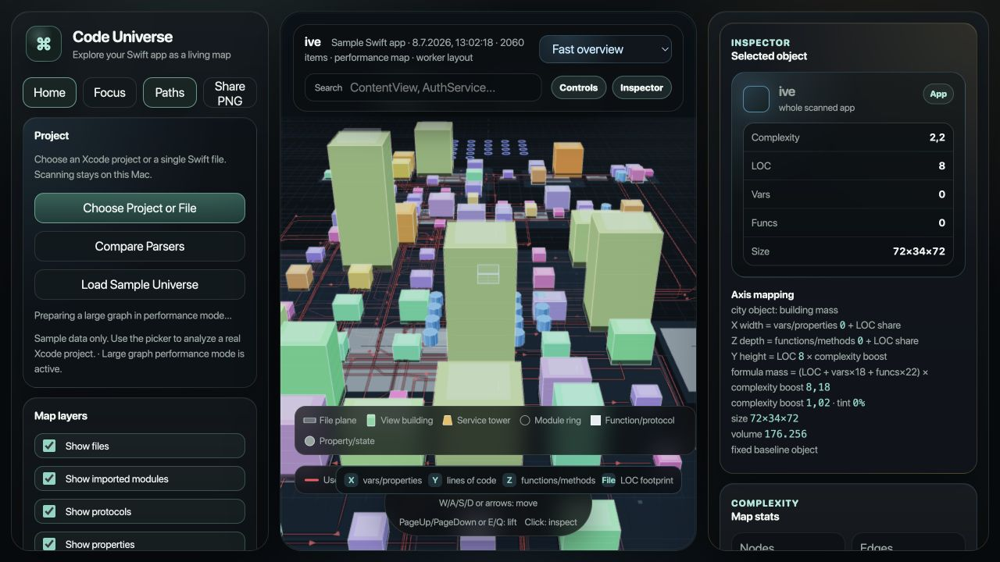

# Code Universe

Code Universe is a local 3D architecture map for Swift projects. It turns an Xcode project into a navigable city where files, views, structs, models, services, functions, properties, imports, and usage relationships can be inspected visually.

The app runs on your Mac. Source code is scanned locally and stays local.



## Current Sample

The bundled sample graph is generated from the included SampleSwiftApp fixture:

```text
examples/SampleSwiftApp
```

This compact seven-file SwiftUI sample is included in the repository and is intended for reproducing the bundled graph.

The current bundled SampleSwiftApp graph contains:

- `45` graph nodes
- `75` relationships
- `7` Swift files
- `14` top-level Swift types

Regenerate it with:

```sh
npm run scan:sample
```

## Visual Model

Code Universe uses a consistent spatial model:

- **File plane**: the flat bottom lot for a Swift file.
- **File lot**: the outer file plane contains that file’s structs, views, models, services, enums, and protocols.
- **LOC inlay**: the smaller translucent inlay on a file plane represents original file size / lines of code.
- **Type object**: a view, struct, enum, model, service, or class sits above its file plane.
- **Object popup**: clicking a type opens its functions, properties, vars, and state inside that object’s popup shell.
- **File popup**: clicking a file opens its top-level contained objects using the same file-lot rule.
- **Connections**: relationship paths show usage, imports, conformances, state ownership, and member usage.

By default, most code objects are bright and opaque for readability. File lots, x-ray shells, labels, and relationship overlays remain translucent where seeing through the scene is useful.

## Run

```sh
npm start
```

Open:

```text
http://127.0.0.1:4173
```

If the port is occupied:

```sh
PORT=4174 npm start
```

## Use

The left control column is ordered for quick work:

1. `Home`, `Focus`, `Paths`, `Share PNG`
2. `Project`
3. `Map layers`
4. `Connection detail`

Connection detail defaults to only `Uses` checked so the map starts readable. Enable imports, conforms, defines, state, member usage, inferred hints, or Xcode index links when you need more detail.

### Project Panel

- `Choose Project or File`: scan an `.xcodeproj`, `project.pbxproj`, folder, or single `.swift` file.
- `Compare Parsers`: compare heuristic, SwiftSyntax, merged, and Xcode-index analysis for the selected project.
- `Load Sample Universe`: reload the bundled SampleSwiftApp graph.

### Map Layers

- `Show files`: toggles file lots.
- `Show imported modules`: toggles module rings.
- `Show protocols`: toggles protocol objects.
- `Show properties`: toggles properties / vars.
- `Selected object edges only`: reduces paths to the current selection.
- `Performance mode`: lowers render cost for large graphs.

### Navigation

- Drag: orbit the 3D map.
- Scroll: zoom.
- `W/A/S/D` or arrow keys: move across the map.
- `PageUp/PageDown` or `E/Q`: move vertically.
- Click an object: inspect it and open the source preview.
- Search and press `Enter`: jump to a matching symbol.

## Parser Modes

The default parser is `Fast overview` for quick large-project scanning.

Available modes:

- `Fast overview`: fast heuristic scanner.
- `Best combined view`: SwiftSyntax structure plus heuristic relationship hints.
- `Accurate Swift parse`: SwiftSyntax structural scan.
- `Xcode Index map`: local Xcode index relationships when available.

Regenerate the sample with SwiftSyntax:

```sh
npm run scan:sample:swiftsyntax
```

The first SwiftSyntax run may resolve Swift package dependencies.

You can set the server default scanner:

```sh
CODE_UNIVERSE_SCANNER=swiftsyntax npm start
```

Supported values are:

```text
heuristic
merged
swiftsyntax
xcode-index
```

## macOS WebKit Shell

A small SwiftPM macOS shell lives in:

```text
mac/CodeUniverseMac
```

Build or run it with:

```sh
npm run mac:build
npm run mac:run
```

Build the app bundle:

```sh
npm run mac:bundle
```

Open the bundle:

```sh
npm run mac:open
```

The shell starts the local Node server, waits for `/api/health`, then loads the browser UI. It is designed to work when opened from Xcode behaviors as well as from the command line.

## Scripts

```sh
npm start
npm run scan:sample
npm run scan:sample:swiftsyntax
npm run test:scan
npm run mac:build
npm run mac:run
npm run mac:bundle
npm run mac:open
```

## Notes

- The app is a visual companion for Xcode, not a replacement IDE.
- Large graphs automatically enable performance mode.
- Relationship filters are intentionally conservative by default.
- Object sizing now uses non-saturated complexity and stronger LOC-based height scaling, so large objects read as visibly larger than small ones.
