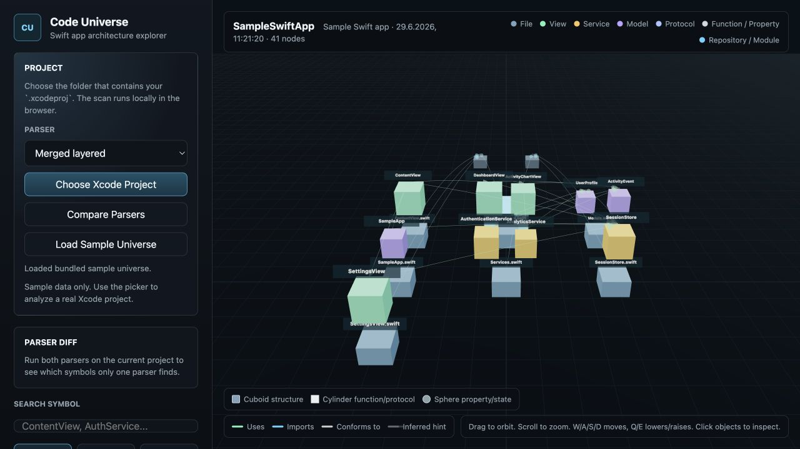

# Code Universe

A 3D architecture map for exploring Swift macOS and iOS codebases alongside Xcode.

## What It Does

- Scans a folder of `.swift` files.
- Extracts files, types, functions, properties, imports, and basic relationships.
- Detects SwiftUI `View` types, services, stores, and simple models.
- Writes a portable graph JSON file.
- Displays the graph as an interactive 3D map in the browser.

## Screenshot



## Run It

```sh
npm start
```

Open:

```text
http://127.0.0.1:4173
```

If the port is occupied:

```sh
PORT=4174 npm start
```

Inside the app, click `Choose Xcode Project`, then select the `.xcodeproj` in the native macOS picker. The local server resolves the project root and scans the Swift source files on disk.

Use `Load Sample Universe` any time to return to the bundled sample graph.

## Map Controls

- `Density`: switch edges between `Clean`, `Normal`, and `Everything`.
- `Share PNG`: exports the current 3D map as a screenshot. Browsers with Web Share support open the native share sheet; others download a PNG.
- `Search`: type a symbol and press `Enter`; matching objects are highlighted.

## Mac App Shell

A small SwiftPM macOS WebKit shell is available in `mac/CodeUniverseMac`.

```sh
npm run mac:build
npm run mac:run
```

For URL-scheme integration with Xcode, build the bundled app once:

```sh
npm run mac:bundle
```

In Xcode, add it under `Xcode > Settings > Behaviors` as a custom script and choose:

```text
scripts/open-code-universe-from-xcode.sh
```

The script first uses Xcode's active workspace/project document. If Xcode does not expose one, it falls back to `$PROJECT_DIR`, `$SRCROOT`, then a folder picker. It opens the bundled app directly with `--scan-path`, so it does not depend on LaunchServices choosing the right URL-scheme handler.

The shell opens `http://127.0.0.1:4174` and tries to start the local Node server from the repo root. You can override the URL:

```sh
CODE_UNIVERSE_URL=http://127.0.0.1:4174 npm run mac:run
```

## Parser Modes

The default app view is `Fast heuristic` so larger projects open quickly. Switch to `Best combined view`, `Accurate Swift parse`, or `Xcode Index map` when you want deeper analysis.

Available modes:

- `Fast heuristic`: fast scanner for quick architecture overviews.
- `Best combined view`: SwiftSyntax structure plus heuristic dependency hints.
- `SwiftSyntax accurate`: syntax-accurate declarations and structural relationships.
- `Xcode Index map`: best local semantic links when Xcode has indexed the project.

```sh
npm run scan:sample:swiftsyntax
```

The first run resolves the `swift-syntax` Swift package dependency, so it needs network access. After that, it emits the same graph JSON shape as the app scanner.

To force one scanner mode from the running app:

```sh
CODE_UNIVERSE_SCANNER=swiftsyntax npm start
```

Supported values are `xcode-index`, `merged`, `swiftsyntax`, and `heuristic`. Use the parser selector in the Project panel to switch modes per scan. The environment variable only sets the server default.

The Xcode index mode reads local `~/Library/Developer/Xcode/DerivedData/*/Index.noindex/DataStore` records. If no matching index store exists, build the app in Xcode once and scan again.

## Analysis Notes

Code Universe starts with a fast heuristic scan so large projects open quickly. Use `Best combined view`, `Accurate Swift parse`, or `Xcode Index map` when you need stronger structural or semantic evidence.

The viewer is shell-independent. The browser view, macOS shell, scanners, and future storage layers all use the same graph JSON contract.
