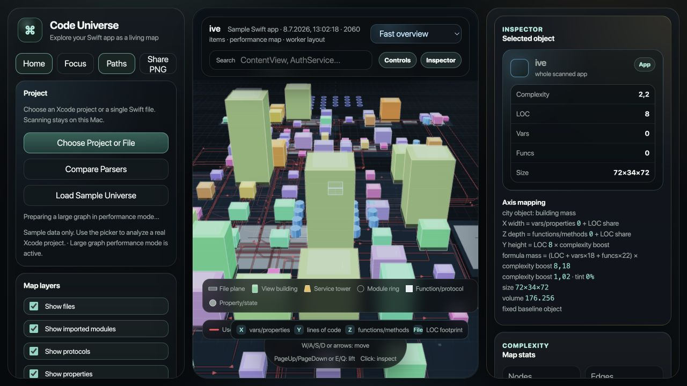

# Code Universe

Code Universe is a local 3D architecture map for Swift, JavaScript, TypeScript, HTML, CSS, Python, PHP, Java, C#, Objective-C, and Objective-C++ projects. It turns a codebase into a navigable city where files, components, types, functions, properties, modules, markup, styles, imports, and usage relationships can be inspected visually.

The app runs on your Mac. Source code is scanned locally and stays local.



[Watch the Code Universe demo](docs/export.mp4)

## Highlights

- Explore Swift, web, Python, PHP, Java, .NET, and Objective-C projects as a navigable 3D code city.
- Scan mixed-language projects through versioned language adapters.
- Resolve JavaScript/TypeScript calls and types through the TypeScript semantic checker.
- Connect CSS Modules and HTML/CSS selectors to the components and elements they style.
- Trace HTML links and image sources, including responsive, external, and embedded image assets.
- Connect JavaScript carousels, JSX media, inline scripts, and DOM selectors to the HTML elements and assets they use.
- Validate local web assets, flag broken references, and distinguish images, video, audio, fonts, embeds, and downloads.
- Reuse unchanged full graphs and independently fingerprinted adapter fragments.
- Inspect files, types, functions, properties, dependencies, and source code.
- Compare heuristic, SwiftSyntax, merged, and Xcode-index analysis for Swift, and compare language adapters with the optional Tree-sitter WASM parser for JavaScript, TypeScript, HTML, CSS, Python, PHP, and Java.
- Ask Codex to investigate or fix a specific application behavior.
- Watch Codex activity appear as a project-scoped trace across the city.
- Review complete token usage, readable conclusions, and verification results.
- Replay investigations and reload the latest trace for each project.

## Current Sample

The bundled sample graph is generated from the included SampleSwiftApp fixture:

```text
examples/SampleSwiftApp
```

This compact seven-file SwiftUI sample is included in the repository and is intended for reproducing the bundled graph.

The current bundled SampleSwiftApp graph contains:

- `45` graph nodes
- `75` relationships
- `7` Swift files
- `14` top-level Swift types

Regenerate it with:

```sh
npm run scan:sample
```

## Visual Model

Code Universe uses a consistent spatial model:

- **File plane**: the flat bottom lot for a Swift file.
- **File lot**: the outer file plane contains that file’s structs, views, models, services, enums, and protocols.
- **LOC inlay**: the smaller translucent inlay on a file plane represents original file size / lines of code.
- **Type object**: a view, struct, enum, model, service, or class sits above its file plane.
- **Object popup**: clicking a type opens its functions, properties, vars, and state inside that object’s popup shell.
- **File popup**: clicking a file opens its top-level contained objects using the same file-lot rule.
- **Connections**: relationship paths show usage, imports, conformances, state ownership, and member usage.

By default, most code objects are bright and opaque for readability. File lots, x-ray shells, labels, and relationship overlays remain translucent where seeing through the scene is useful.

## Run

```sh
npm start
```

Open:

```text
http://127.0.0.1:4173
```

If the port is occupied:

```sh
PORT=4174 npm start
```

## Use

The left control column is ordered for quick work:

1. `Home`, `Focus`, `Paths`, `Share PNG`
2. `Project`
3. `Map layers`
4. `Behavior review`
5. `Connection detail`

Connection detail defaults to only `Uses` checked so the map starts readable. Enable imports, conforms, defines, state, member usage, inferred hints, or Xcode index links when you need more detail.

### Project Panel

- `Choose Project or File`: scan a project folder or a single Swift, JavaScript, TypeScript, HTML, CSS, Python, PHP, Java, C#, Objective-C, or Objective-C++ file.
- `Compare Parsers`: compare Swift parser layers and language adapters against Tree-sitter WASM. Mixed projects show both comparisons while retaining the legacy Swift response.
- `Load Sample Universe`: reload the bundled SampleSwiftApp graph.

### Map Layers

- `Show files`: toggles file lots.
- `Show imported modules`: toggles module rings.
- `Show protocols`: toggles protocol objects.
- `Show properties`: toggles properties / vars.
- `Selected object edges only`: reduces paths to the current selection.
- `Performance mode`: lowers render cost for large graphs.

### Navigation

- Drag: orbit the 3D map.
- Scroll: zoom.
- `W/A/S/D` or arrow keys: move across the map.
- `PageUp/PageDown` or `E/Q`: move vertically.
- Click an object: inspect it and open the source preview.
- Search and press `Enter`: jump to a matching symbol.

## Analysis Profiles

The default profile is `Fast overview` for quick large-project scanning.

Available modes:

- `Fast overview`: fastest adapter-supported structure scan.
- `Best combined view`: balanced structure and relationship resolution.
- `Accurate parse`: strongest local parser mode.
- `Tree-sitter WASM`: optional WebAssembly syntax pass for JavaScript/TypeScript,
  HTML, CSS, Python, PHP, and Java with graceful fallback to structural adapters.
- `Indexed map`: local semantic indexes when an adapter supports them.

For Swift these profiles preserve the existing heuristic, merged, SwiftSyntax, and Xcode-index implementations. JavaScript and TypeScript use the TypeScript compiler parser; HTML and CSS use parse5 and PostCSS. Python, PHP, and Java use the neutral Tree-sitter language adapter, with exact syntax metadata in the Tree-sitter profile and a dependency-free structural fallback otherwise. The optional Tree-sitter profile adds WebAssembly syntax metadata without replacing semantic and DOM adapters.

Regenerate the sample with SwiftSyntax:

```sh
npm run scan:sample:swiftsyntax
```

The first SwiftSyntax run may resolve Swift package dependencies.

You can set the server default scanner:

```sh
CODE_UNIVERSE_SCANNER=swiftsyntax npm start
```

Supported values are:

```text
heuristic
merged
swiftsyntax
xcode-index
tree-sitter
```

Tree-sitter is an optional npm capability. A normal `npm install` includes the
WebAssembly runtime and prebuilt web grammars; installations that omit optional
dependencies continue to use the existing adapters and report the fallback in scan
diagnostics. The Tree-sitter CLI is not required at runtime.

## Codex Behavior Reviews

Review Mode overlays observable Codex activity on the existing source city. Inspected code is blue, searches purple, suspected causes amber, edits and successful verification green, and failures red. Bright rectangular streets show the order of the investigation.

### Codex Features

- **Large behavior prompt**: describe reproduction steps, expected behavior, relevant screens, and constraints in a multiline prompt.
- **Permission modes**: choose read-only investigation with `Inspect only` or allow focused source changes with `Inspect and fix`.
- **Model and reasoning controls**: inherit the current Codex defaults or choose/edit a model and reasoning effort for each review; the effective values are stored with the trace.
- **Visual investigation trace**: see searches, inspections, suspected causes, edits, builds, tests, and conclusions mapped onto project objects.
- **Exact review diffs**: click an edit step to inspect the review-scoped unified patch with green additions, red removals, line counts, and a shortcut to the complete source file.
- **Apply findings**: turn a completed `Inspect only` report into a linked `Inspect and fix` review that verifies the findings before editing.
- **Clean project scope**: ignore generated folders and external files, normalize source paths, collapse file inventories, and remove repetitive trace noise.
- **Node-focused navigation**: selecting a trace step highlights its mapped object without opening a popup or moving the camera.
- **Complete token ledger**: view total, input, uncached input, cached input, output, visible output, reasoning-output tokens, and metered model turns without double-counting subsets.
- **Readable final report**: preserve long conclusions and render headings, lists, source references, inline code, and code blocks in a copyable result panel.
- **Integrated source view**: open the complete source file, highlight the relevant range, or jump directly to the configured editor.
- **Trace replay**: replay the investigation with progressive highlights and route streets, pause or resume it, and choose 0.5×, 1×, or 2× speed.
- **Project trace history**: automatically load the latest saved trace for the selected project or restore it with `Load Latest Trace`.
- **Import and automation**: import JSON traces or send review events through the command-line bridge.

Choose the project in Code Universe, enter the behavior in the `Behavior review` panel, choose a permission mode, and select `Run Codex Review`.

- `Inspect only` launches Codex in a read-only sandbox and cannot change source files.
- `Inspect and fix` allows Codex to edit the selected project and run focused verification.

Git repositories retain Codex's normal repository trust check. When the selected project is a plain source folder—common for standalone HTML/CSS/JavaScript sites—Code Universe detects that it is not a Git work tree and launches `codex exec` with the explicit `--skip-git-repo-check` option. The sandbox, selected `sourceRoot`, MCP token, and project-scoped file validation remain unchanged.

After an `Inspect only` review completes, select `Apply findings` in the final-result card or drawer. Code Universe starts a new `Inspect and fix` review for the same project, includes the previous report as a hypothesis, and stores the originating review in `parentReviewId`.

Code Universe launches the Codex runtime bundled with the ChatGPT desktop app, consumes its JSONL event stream, and automatically maps observable searches, source inspections, file changes, builds, tests, and the final report onto the city. The review summary lists total, input, uncached input, cached input, output, visible output, reasoning-output tokens, and metered model turns without double-counting subsets. Private reasoning is neither requested nor stored.

### Code Universe MCP

Each review launches a temporary local STDIO MCP server named `code_universe`. No global Codex configuration or project file is required. Code Universe injects the server configuration into the review process and provides a short-lived token that is valid only while that review is running.

The MCP server exposes seven bounded, read-only tools:

- `get_project_summary`
- `search_nodes`
- `get_node`
- `get_relationships`
- `find_change_impact`
- `read_source`
- `get_latest_trace`

Codex uses these tools to query the graph before broad source searches. MCP calls are labeled in the review timeline and mapped to the returned file or object. The MCP server cannot edit files, run shell commands, open Xcode, or access a different project. In `Inspect and fix` mode, source changes still use Codex's normal workspace tools, approvals, Git patch capture, and focused verification.

Trace extraction is project-scoped and language-neutral: generated build folders and external files are ignored, project-wide source inventories are collapsed, repeated inspection/search events are deduplicated within each review phase, and build/test commands use concise outcome labels. The review records the detected primary language and full language mix so Codex uses appropriate terminology and tools for Swift, web, Python, PHP, Java, C#, Objective-C, or mixed projects. Fix reviews use a bounded supported-source snapshot when a Git baseline is unavailable, so edit steps can still show their unified diff.

Completed and imported traces can be replayed from the `Review path` panel. Replay progressively reveals mapped nodes and route streets, supports pause/resume and 0.5×, 1×, or 2× speed, and reveals the final report only when the conclusion step is reached.

When a different project is scanned, Code Universe automatically requests that project's latest saved trace. `Load Latest Trace` repeats the lookup explicitly and can restore a trace after its overlay was hidden.

The command-line bridge remains available for adding events from another Codex task or from a manual workflow:

```sh
npm --prefix /path/to/code-universe run review -- inspect Sources/ScannerService.swift 84 "Inspect scanner entry point"
npm --prefix /path/to/code-universe run review -- suspect Sources/ScannerService.swift 112 "Synchronous process blocks the caller"
npm --prefix /path/to/code-universe run review -- edit Sources/ScannerService.swift 112 "Move scan work off the main actor"
npm --prefix /path/to/code-universe run review -- test passed "Large-project scan completes"
npm --prefix /path/to/code-universe run review -- finish passed "Freeze no longer reproduced"
```

The npm bridge preserves the directory from which it was invoked. Set `CODE_UNIVERSE_SOURCE_ROOT` explicitly when another tool changes that directory, and set `CODE_UNIVERSE_URL` when Code Universe uses a port other than `4173`. Set `CODE_UNIVERSE_CODEX_PATH` if the desktop Codex runtime is installed in a nonstandard location.

Completed JSON traces can also be loaded with `Import Trace`. The format is documented in `docs/review-schema.md`.

## macOS WebKit Shell

A small SwiftPM macOS shell lives in:

```text
mac/CodeUniverseMac
```

Build or run it with:

```sh
npm run mac:build
npm run mac:run
```

Build the app bundle:

```sh
npm run mac:bundle
```

The bundle task creates a self-contained Electron/Chromium app plus a ZIP archive
and SHA-256 checksum in `dist/`. It renders the same npm UI as the browser version
and includes the language adapters, optional Tree-sitter WASM grammars, and the
SwiftSyntax scanner. The target Mac does not need the source repository, Node.js,
npm, or Swift Package Manager.

The earlier Swift/AppKit shell remains available as a rollback target:

```sh
npm run mac:bundle:native
```

Set `CODE_UNIVERSE_SIGN_IDENTITY` to a Developer ID Application certificate
identity for a distributable signed build. Without one, the scripts create an
ad-hoc-signed archive for local testing. The native rollback build additionally
accepts `CODE_UNIVERSE_NODE_BINARY` when the build machine's Node executable has
non-system dynamic-library dependencies.

Open the bundle:

```sh
npm run mac:open
```

The Electron shell starts its bundled local server on an available private port,
waits for `/api/health`, and then loads the npm UI in Chromium. The separate native
shell remains designed for Xcode behaviors and command-line development.

## Scripts

```sh
npm start
npm run scan:sample
npm run scan:sample:swiftsyntax
npm run test:scan
npm run test:review
npm run test:mcp
npm run review -- help
npm run mac:build
npm run mac:run
npm run mac:bundle
npm run mac:bundle:native
npm run mac:open
```

## Notes

- The app is a visual companion for Xcode, not a replacement IDE.
- Large graphs automatically enable performance mode.
- Relationship filters are intentionally conservative by default.
- Object sizing now uses non-saturated complexity and stronger LOC-based height scaling, so large objects read as visibly larger than small ones.
